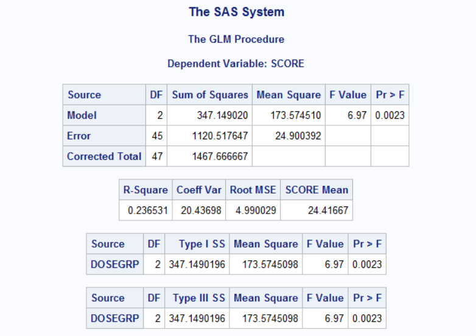
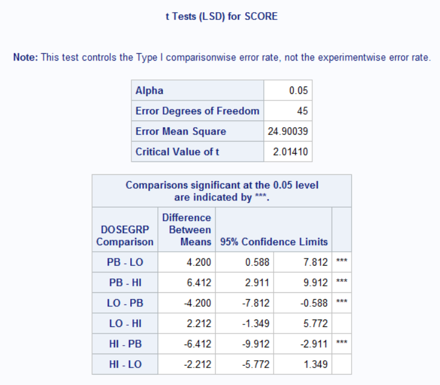
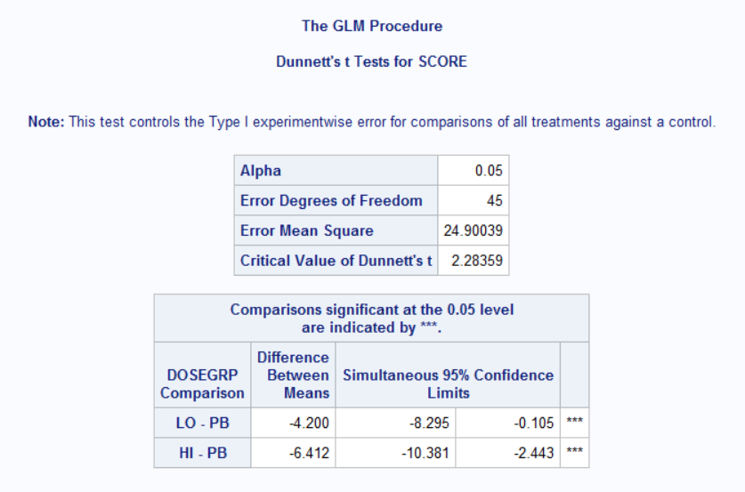

# One-Way ANOVA

One-way ANOVA(analysis of variance) is used to simultaneously compare two or more group means based on independent samples from each group.

> The bigger the **variation among sample group means** relative to the **variation of individual measurements within the groups**,
> the greater the evidence that the hypothesis of equal group means is untrue.

The ANOVA methods seek to identify sources of variation for each measurements, and separate the total variability into components:

+ total variability: sum of squared deviations of each measurements from the overall mean.
    + sum of squares due to suspected sources of variation (often called 'model sum of squares')
    + sum of squares due to error

> The error variability includes such things as measurement error, normal variation due to repeated sampling
> The sources that can be identified and controlled are included in the model SS.

An ANOVA is conducted using F-tests that are constructed from the ratio of between-group to within-group variance estimates. Under the hypothesis of
no group effect, the variation among groups is just another measure of patient-to-patient variability, so their ratio should be about 1.

The one-way ANOVA has **one main effect or grouping factor** with two or more levels(e.g. typically treatment effect).

The two-way ANOVA has **two main** effects, usually a grouping or treatment factor and a blocking factor(such as Gender, Study Center)


In most types of ANOVA used in clinical trials, the primary question the researcher wants to answer is whether there are any differences
among the group population means based on the sample data. The null hypothesis to be tested is "there is no Group effect" or, equivalently, "the
mean responses are the same for all groups". The alternative hypothesis is that "the Group effect is important" or, equivalently, "the Group means
differ for at least one pair of groups".

The one-way ANOVA involves a straightforward comparison of the between-group variation to the within-group variation. An ANOVA that involves blocking
factors or covariates seeks to refine treatment comparison by factoring out extraneous variation due to **known** sources.

## SAS example

```markdown
data scores;
  input patno dosegrp $ score @@;
  cards;
  101 LO 21 104 LO 18
  106 LO 19 110 LO .
  112 LO 28 116 LO 22
  120 LO 30 121 LO 27
  124 LO 28 125 LO 19
  130 LO 23 136 LO 22
  137 LO 20 141 LO 19
  143 LO 26 148 LO 35
  152 LO .  103 HI 16
  105 HI 21 190 HI 31
  111 HI 25 113 HI 23
  119 HI 25 123 HI 18
  127 HI 20 128 HI 18
  131 HI 16 135 HI 24
  138 HI 22 140 HI 21
  142 HI 16 146 HI 33
  150 HI 21 151 HI 17
  102 PB 22 107 PB 26
  108 PB 29 114 PB 19
  115 PB .  117 PB 33
  118 PB 37 122 PB 25
  126 PB 28 129 PB 26
  132 PB .  133 PB 31
  134 PB 27 139 PB 30
  144 PB 25 145 PB 22
  147 PB 36 149 PB 32
  ;
run;

proc sort data=scores;
  by dosegrp;
run;

proc means data=scores mean std n;
  by dosegrp;
  var score;
run;

proc glm data=scores plots=boxplot;
  class dosegrp; /*model factor must also be specified in the CLASS statement to 
  indicate it is a classification factor rather than a numeric covariate*/
  model score=dosegrp; /* response variable on the left, model factors on the right*/
  means dosegrp / hovtest t dunnett ('PB');
  contrast 'Active vs . Placebo' dosegrp 0.5 0.5 -1;
run;
quit;

```

## Sample Result 

```{r, echo=FALSE, out.width="200%"}

```

The p-value of 0.0023 (<0.05) indicates that the **mean scores differ significantly among Dose Groups**.

With a significant Dose Group effect, the next question is which group or groups contribute to that difference.

> The **means statment** is used to obtain multiple comparison results using both the **pairwise t-test** and **Dunnett's test**: 
> both of thse methods reveal significant differences between each active group and placebo.

### Pairwise t-test

```{r, echo=FALSE, out.width="200%"}

```

### Dunnett's test

```{r, echo=FALSE, out.width="200%"}

```

### side-by-side
```{r, echo=FALSE, fig.show='hold', out.width="50%"}


```

A one-way ANOVA requires the assumptions of:
+ normally distributed data
+ independent samples from each group
+ variance homogeneity among groups

A number of formal tests, such as **Levene's test** or **Bartlett's test**, can be used to test for homogeneity of variances. 
In SAS, we simply include the **HOVTEST** option in the **means statement** to run **Levene's test**: the p-value for equal variances in the example
is 0.998. This, along with the box plot, indicates no differences among the groups in variability.

In the event that equal variances among groups is not a plausible assumption, we can conduct an approximate test, known as **Welch's test**,
for comparing the group means. We can do this like **"means dosegrp/welch". **Welch's test** is analogous to the **"Satterthwaite's adjustment"** used in
two-sample t-test.

### Some notes

> When comparing more than 2 means, a significant F-test indicates that at least one pair of means differs, but which pair is not identified by **ANOVA**
> If null hypothesis of equal means is rejected, further analysis must be undertaken to investigate where the differences lie.

> all-pairwise tests: similar to two-sample t-test, but rather that using the pooled standard deviation of only the two groups being compared, the pooled
> standard deviation of all groups is used. Use ** "means dosegrp / t"** (t option)

> compares treatment means with a control group is called **"Dunnett's test"**

> contrast statement: customized comparisons among combinations of the group means can be made. This is done by testing whether specific linear combinations of the group means differ from 0

> By using the **estimate** statement in SAS following the **model** statement, we can obtain the mean and standard error of the group mean

```markdown
proc glm data=scores;
  class dosegrp;
  model score=dosegrp;
  /*obtain mean and standard error for each group*/
  estimate "Hi Dose Group" intercept 1 dosegrp 1 0 0; /*intercept term corresponding to overall mean*/
  estimate "Lo Dose Group" intercept 1 dosegrp 0 1 0; 
  estimate "Placebo Dose Group" intercept 1 dosegrp 0 0 1; 

  /*obtain mean difference and standard error*/
  estimate "Lo Group vs. Placebo" dosegrp 0 1 -1;

run;
quit;
```

> If there are only two groups, the p-value for Group effect using an ANOVA is the same as that of a two-sample t-test. The F- and t-distribution enjoy the relationship that, with 1 upper degree of freedom, the F-statistic is the square of the t-statistic.

> For one-way ANOVA, all four types of sums of squares are identical.