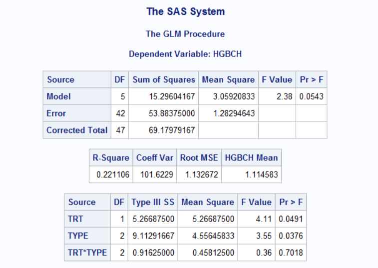
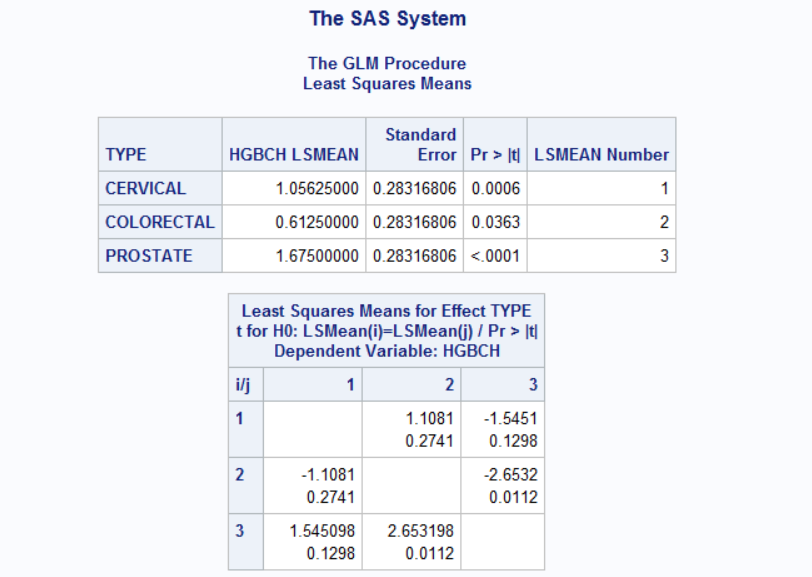
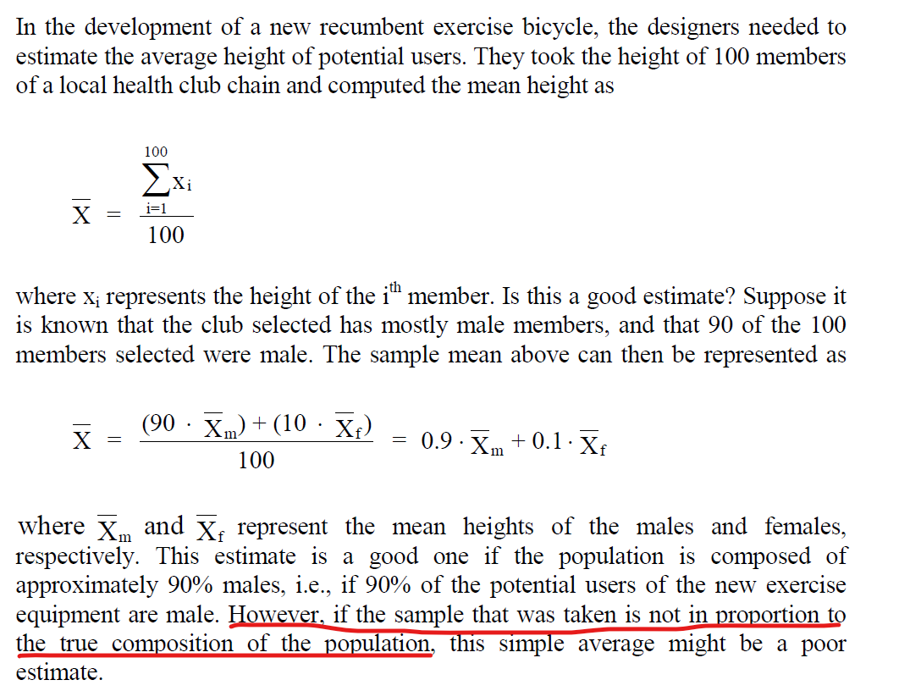
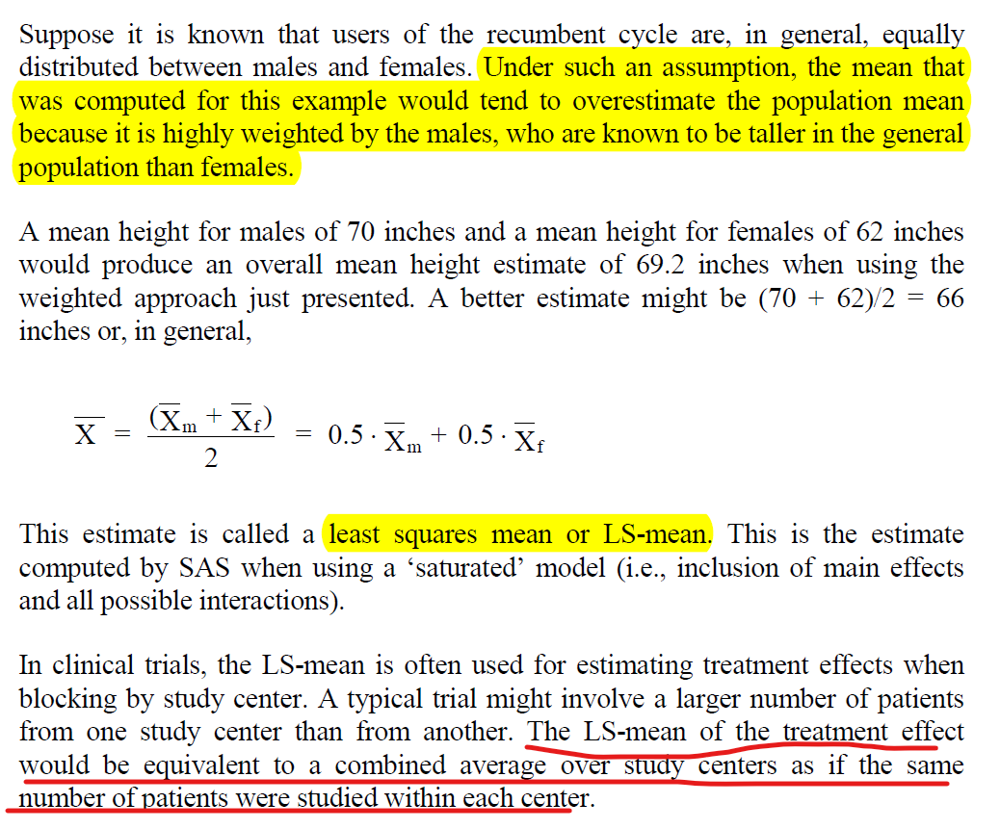
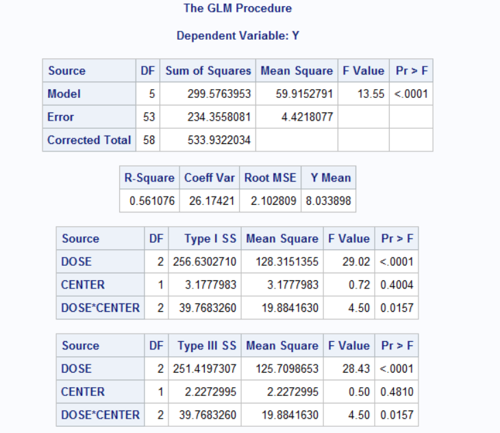
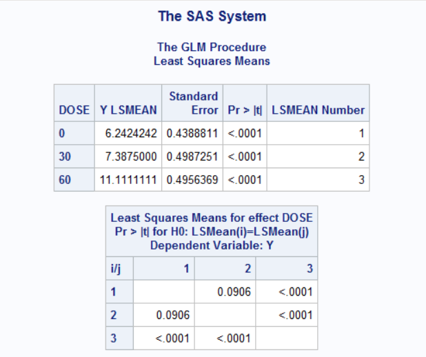
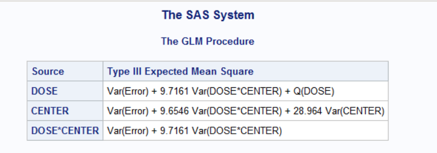

# Two-Way ANOVA

The two-way ANOVA is a method for simultaneously analyzing two factors that affect a response.


## SAS example

```markdown
data hgbds;
  input trt $ type $ patno hgbch @@;
  datalines;
  ACT C 1 1.7 ACT C 3 -0.2 ACT C 6 1.7
  ACT C 7 2.3 ACT C 10 2.7 ACT C 12 0.4
  ACT C 13 1.3 ACT C 15 0.6 ACT P 22 2.7
  ACT P 24 1.6 ACT P 26 2.5 ACT P 28 0.5
  ACT P 29 2.6 ACT P 31 3.7 ACT P 34 2.7
  ACT P 36 1.3 ACT R 42 -0.3 ACT R 45 1.9
  ACT R 46 1.7 ACT R 47 0.5 ACT R 49 2.1
  ACT R 51 -0.4 ACT R 52 0.1 ACT R 54 1.0
  PBO C 2 2.3 PBO C 4 1.2 PBO C 5 -0.6
  PBO C 8 1.3 PBO C 9 -1.1 PBO C 11 1.6
  PBO C 14 -0.2 PBO C 16 1.9 PBO P 21 0.6
  PBO P 23 1.7 PBO P 25 0.8 PBO P 27 1.7
  PBO P 30 1.4 PBO P 32 0.7 PBO P 33 0.8
  PBO P 35 1.5 PBO R 41 1.6 PBO R 43 -2.2
  PBO R 44 1.9 PBO R 48 -1.6 PBO R 50 0.8
  PBO R 53 -0.9 PBO R 55 1.5 PBO R 56 2.1
  ;
run;

proc format;
  value $typfmt 'C' = 'CERVICAL '
                'P' = 'PROSTATE '
                'R' = 'COLORECTAL' ;
run;

proc glm data=hgbds;
  class trt type;
  model hgbch = trt type trt*type /ss3;
  lsmeans type / pdiff stderr t lines;
  format type $typfmt.;
run;
quit;

```

## Sample Result

```{r, echo=FALSE, out.width="200%"}

```

### Some notes

+ There is significant difference in treatment effect (p=0.0491)
+ There is also significant difference among Cancer Types (p=0.0376), but because there are more than 2 levels of this effect, further analysis are needed to determine where the differences exist.

> To perform pairwise t-tests for multiple comparisons, we can include the **lsmeans** statment with **T** option after the **model** statment.

+ mean hemoglobin response differs significantly between the PROSTATE and COLORECTAL Cancer Types

```{r, echo=FALSE, out.width="200%"}

```

## Least Squares Mean (LS-mean)

```{r, echo=FALSE, out.width="200%"}


```
```{r, echo=FALSE, out.width="200%"}


```
```{r, echo=FALSE, out.width="200%"}


```
```{r, echo=FALSE, out.width="200%"}


```

## Unbalanced Two-way ANOVA

```markdown
data memry;
  input dose $ center $ y @@;
  datalines;
  0 A 6 0 A 5 0 A 6 0 A 8 0 A 3
  0 A 4 0 A 5 0 A 6 0 A 5 0 A 5
  0 A 7 0 A 8 0 B 7 0 B 4 0 B 7
  0 B 6 0 B 7 0 B 8 0 B 5 0 B 9
  0 B 11 0 B 4 0 B 7 30 A 8 30 A 12
  30 A 7 30 A 8 30 A 6 30 A 9 30 A 6
  30 A 11 30 B 5 30 B 6 30 B 6 30 B 5
  30 B 3 30 B 8 30 B 6 30 B 9 30 B 11
  30 B 5 60 A 11 60 A 7 60 A 7 60 A 11
  60 A 9 60 A 10 60 A 12 60 A 9 60 A 15
  60 B 9 60 B 12 60 B 13 60 B 9 60 B 13
  60 B 12 60 B 14 60 B 15 60 B 12
  ;
run;

proc glm data=memry;
  class dose center;
  model y=dose center dose*center;
  lsmeans dose/pdiff stderr;
run;
quit;
```

```{r, echo=FALSE, out.width="200%"}


```

## Some notes
From the SAS outputs, we can conclude that a difference exists between the 60 mg dose and the placebo, but the overall efficacy of the 30 mg dose is in question.

### "Mixed" effects
There are two types of effects that can be used in an ANOVA model, the **"fixed"** effect and **"random"** effect.

+ Fixed: pre-specified levels, with the goal of comparing specific levels of that effect, e.g. treatment group
+ Random: blocking factor in a two-way ANOVA can be either fixed or random. e.g. Study Center is frequently considered a random effect since the centers often represent a sample from a large number of centers available to conduct the study.

```markdown
/* study center as a random effect */
proc glm data=memry;
  class dose center;
  model y=dose center dose*center;
  random center dose*center;
  test h=dose e=dose*center;
  lsmeans dose /pdiff stderr;
run;
quit;

```

```{r, echo=FALSE, out.width="200%"}

```

### Using Proc Mixed

When using SAS, **Proc Mixed** is preferable to **Proc GLM** in many situations.

```markdown
proc mixed data=memry;
  class dose center;
  model y=dose center dose*center;
  lsmeans dose*center /diff;
run;
quit;


/*study center is random effect*/
/*this mixed model analysis enables us to make inferences about the Dose effect that 
applies to the entire population without concern for the levels of random effects*/

proc mixed data=memry;
  class dose center;
  model y=dose; /*study center not included here*/
  random center dose*center;
  lsmeans dose /diff;
run;
quit;
```

> In SAS, Type III corresponds to the method of weighted squares of means and is often the method of choice for the analysis of clinical data.