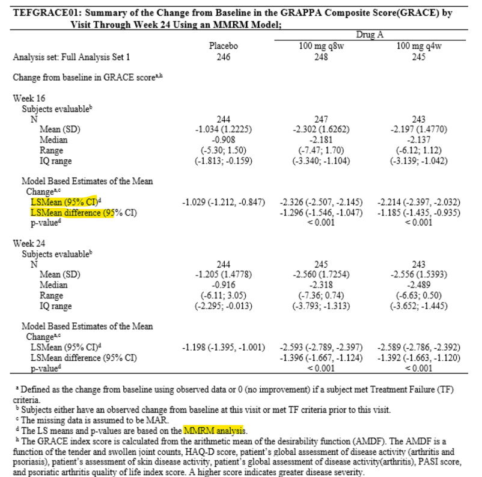

# Repeated Measures

## Introduction

**Repeated measures** refer to multiple measurements taken from the same experimental unit. These repeated response measurements can be used to characterize a response profile over time. One of the main question the researcher asks is whether the mean response profile for one treatment group is the same as for another treatment group or a placebo group.

More commonly used now are approaches based on general linear modeling techniques. 

## SAS example

```markdown
data arthr;
  input vacgrp $ pat mo1 mo2 mo3 ;
  datalines;
  ACT 101 6 3 0
  ACT 103 7 3 1
  ACT 104 4 1 2
  ACT 107 8 4 3
  PBO 102 6 5 5
  PBO 105 9 4 6
  PBO 106 5 3 4
  PBO 108 6 2 3
  ;
run;

data discom; 
  set arthr;
  keep vacgrp pat visit score;
  score = mo1; visit = 1; output;
  score = mo2; visit = 2; output;
  score = mo3; visit = 3; output;
run;

title3 "PROC MIXED with Unstructured Covariance";
proc mixed data = discom;
  class vacgrp pat visit;
  model score = vacgrp visit vacgrp*visit;
  repeated visit / subject=pat(vacgrp) type=un;
run;
quit;
```

## Example from trial

### Sample MMRM program

```markdown
ods output Estimates=_mmrm_est LSMeans=_lsmeans_est;

/* for Week 16*/
proc mixed data=_dsn(where=(avisitn>20000));
  class trt01p(ref="Placebo") avisitn dmdstrat crpstrat usubjid;
  model chg=trt01p avisitn base dmdstrat crpstrat trt01p*avisitn/noint cl ddfm=kr outpm=resid_mmrm vciry;
  repeated avisitn/subject=usubjid type=un;
  lsmeans trt01p*avisitn/cl;
  estimate "100q4w vs placebo" trt01p 1 0 -1 trt01p*avisitn 1 0 0 0 -1 0/e cl;
  estimate "100q8w vs placebo" trt01p 0 1 -1 trt01p*avisitn 0 0 1 0 -1 0/e cl;
run;

/* for Week 24*/
proc mixed data=_dsn(where=(avisitn>20000));
  class trt01p(ref="Placebo") avisitn dmdstrat crpstrat usubjid;
  model chg=trt01p avisitn base dmdstrat crpstrat trt01p*avisitn/noint cl ddfm=kr outpm=resid_mmrm vciry;
  repeated avisitn/subject=usubjid type=un;
  lsmeans trt01p*avisitn/cl;
  estimate "100q4w vs placebo" trt01p 1 0 -1 trt01p*avisitn 0 1 0 0 0 -1/e cl;
  estimate "100q8w vs placebo" trt01p 0 1 -1 trt01p*avisitn 0 0 0 1 0 -1/e cl;
run;

```

### Sample MMRM output

```{r, echo=FALSE, out.width="200%"}

```