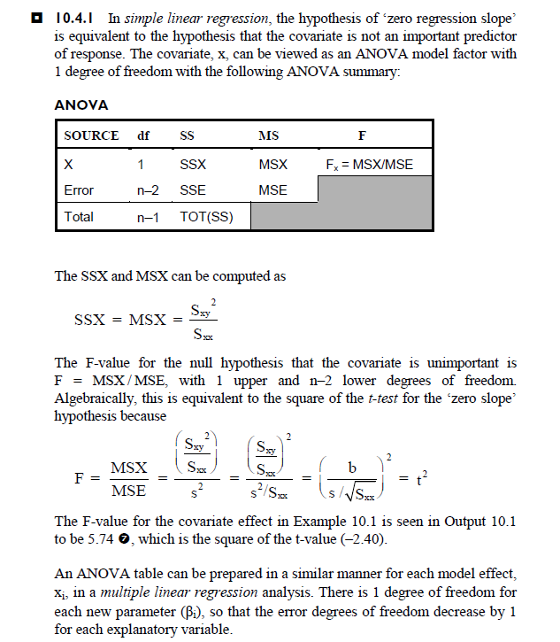

# Linear Regression

## Introduction

Given a number of observed values of a normally distributed response variable(y~1~, y~2~, ..., y~n~), the mean, y hat, represents the estimate of a future response. The idea behind regression analysis is to improve this estimate by using the value of some related factor, X.


```markdown
data angina;
  input pat x_dur y_impr @@;
  datalines;
  1 1 40 2 1 90 3 3 30 4 2 30
  5 1 80 6 5 60 7 1 10 8 4 -10
  9 2 50 10 6 40 11 1 60 12 4 0
  13 2 50 14 2 110 15 3 20 16 3 70
  17 5 -30 18 3 20 19 1 40 20 6 0
  ;
run;

proc sort data=angina;
  by x_dur y_impr;
run;

proc glm data=angina;
  model y_impr = x_dur / p clm ss1; /* p: predicted values, CLM: confidence intervals*/
run;
quit;

```

## Some notes

```{r, echo=FALSE, out.width="200%"}

```