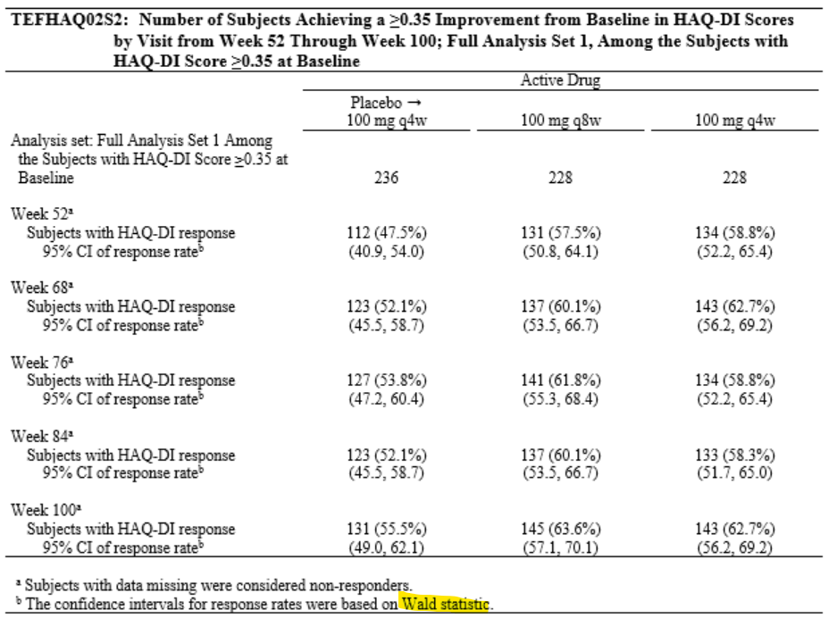

# The Binomial Test

## Overview

The **binomial test** is used to make inferences about a proportion or response 
rate based on a series of independent observations, each resulting in one of two
possible mutually exclusive outcomes, such as: 

    + response to treatment vs. no response

    + cure or no cure

    + survival or death

    + event vs non-event (in general)

The total number of *events* in n observations, X, follows the binomial probability
distribution. Intuitively, the sample proportion, X/n, would be a good estimate of
the unknown population proportion, p. Statistically, it is the best estimate.

You want to determine whether the population proportion, p, differs from a 
hypothesized value, p~0~. If the unknown proportion, p, equals p~0~, then the estimated proportion, X/n, 
should be close to p~0~, i.e., X should be close to n * p~0~. When p differs from p~0~, 
X might be much larger or smaller than n * p~0~.

SAS function, **probbnml()** can be used to determine X~L~ and X~U~ (lower limit and 
upper limit)

## Normal Approximation
For larger values of n and non-extreme values of p, a binomial response, X, can be 
approximated by a normal distribution with mean n * p and variance n * p * (1-p). This
approximation improves as n gets larger or as p gets closer to 0.5


## A proc freq example

```markdown
data acr20;
    input patient $ avalc $ @@;
    cards;
    1 Yes 2 No
    3 Yes 4 No
    5 Yes 6 Yes
    7 No  8 Yes
    9 No  10 No
    11 Yes 12 No
    13 Yes 14 No
    15 Yes 16 No
    17 No  18 Yes
    19 Yes 20 No
    21 Yes 22 Yes
    23 No 24 Yes
    25 Yes
    ;
run;

data acr20a;
    set acr20;
    avalc=ifc(avalc="Yes", "1Yes", "2No");
run;

proc freq data=acr20a;
    tables avalc / binomialc (p = 0.4) alpha=0.05;
    exact binomial;
    title1 "Binomial Test";
run;
```
### A real example from trial

```{r, echo = FALSE}

```

#### proc freq to calculate Wald CI

```markdown
data resp;
    input avisitn avisit $ trt01pn avalc $ count;
    cards;
    20052 Week_52 1 N 124
    20052 Week_52 1 Y 112
    20052 Week_52 2 N 97
    20052 Week_52 2 Y 131
    20052 Week_52 3 N 94
    20052 Week_52 3 Y 134
    20068 Week_68 1 N 113
    20068 Week_68 1 Y 123
    20068 Week_68 2 N 91
    20068 Week_68 2 Y 137
    20068 Week_68 3 N 85
    20068 Week_68 3 Y 143
    ;
run;

proc sort data=resp;
    by avisitn avisit trt01pn;
run;

ods output BinomialCLs=bincl;  
proc freq data=resp;
    by avisitn avisit trt01pn;
    table avalc/binomial(level = "Y" CL=WALD(CORRECT)); 
    weight count;
run;

data resp2;
    set bincl;
    if proportion not in (0,.) then percent = round(proportion * 100, .1);
    else percent=0;
    if lowercl not in (0,.) then lowercl = round(lowercl * 100, .1); 
    else lowercl=0;
    if uppercl not in (0,.) then uppercl = round(uppercl * 100, .1); 
    else uppercl=0;
run;
```
[SAS doc](https://documentation.sas.com/?cdcId=pgmsascdc&cdcVersion=9.4_3.5&docsetId=procstat&docsetTarget=procstat_freq_syntax08.htm&locale=en#procstat.freq.freqbwald)
